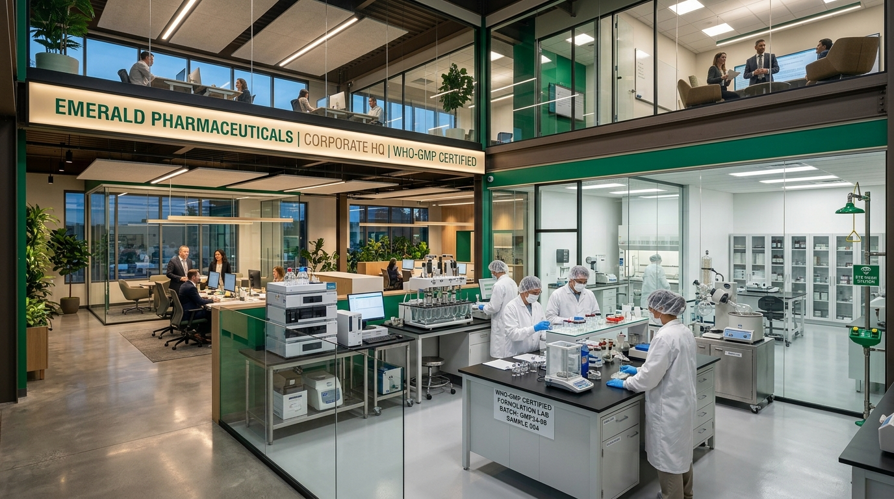

# Skylarr Labs — PCD Pharma Franchise Platform

A responsive, high-converting pharmaceutical franchise lead-generation platform for **Skylarr Labs**. Built with modern frontend architecture, verified trust metrics, dynamic territory-based BDM routing, and a comprehensive 450+ molecule showcase.



---

## 🚀 Tech Stack

- **Framework:** React 19 + TypeScript + Vite 8
- **Styling:** Tailwind CSS v4 + Radix UI / Shadcn UI components
- **Motion & Animations:** Anime.js v4 (animated stats counters, scroll reveals, respect for `prefers-reduced-motion`)
- **Icons:** Lucide React
- **Design Tokens:**
  - **Emerald Ink** (`#064E3B`) — Primary brand, headings, primary CTAs
  - **Champagne** (`#F8E7C9`) & **Gold** (`#D4A95D`) — Warm accents & badges
  - **Soft Sage** (`#EAF3EE`) & **Pure White** (`#FFFFFF`) — Section surfaces

---

## 🌟 Key Features

1. **14 Dedicated Content Sections:**
   - Sticky Header & Navigation with mobile drawer and territory CTA
   - Hero Section with value proposition and trust badges
   - Anime.js Animated Trust Stats (450+ Formulations, 28+ States, 99.4% Dispatch SLA, 15+ Years Experience)
   - Corporate Infrastructure & Interactive Video Walkthrough Modal
   - Franchise Benefits Grid (Monopoly rights, direct net margins, promotional kit, same-day dispatch)
   - 4-Step Partner Onboarding Timeline
   - Persona Qualification Matcher (MRs, ASMs/RMs, Stockists, Entrepreneurs)
   - 450+ Molecule Catalog with Therapeutic Division Tabs (Antibiotics, Cardio-Diabetic, Pediatric, Derma, Gastro, Nutra)
   - Complimentary Marketing Detailing Kit Showcase
   - Behind-the-Scenes Manufacturing & Logistics Media Gallery
   - Ethical Partner Testimonials
   - Accessible FAQ Accordion
   - Qualified Lead Capture Form with live validation, dynamic State $\rightarrow$ District dropdowns, and BDM routing
   - Statutory Compliance Footer with Drug License & territory disclaimers, privacy policy, and franchise terms

2. **Lead Routing & Reference System:**
   - Automatic regional BDM assignment (West, North, South, East & Central zones)
   - Issues unique tracking reference codes (`SL-XXXXXX`)
   - Interactive Application Status Tracker modal
   - 1-Click WhatsApp handoff to the assigned BDM

---

## 🛠️ Local Setup & Development

```bash
# Clone the repository
git clone https://github.com/vighneshpote55-svg/skylarr-labs.git

# Navigate to project directory
cd skylarr-labs

# Install dependencies
npm install

# Start local dev server
npm run dev

# Build for production
npm run build
```

---

## 📁 Repository Structure

```
├── public/
│   └── images/                     # High-fidelity facility, product, and kit visuals
├── src/
│   ├── components/
│   │   ├── ui/                     # Shadcn / Radix UI accessible primitives
│   │   ├── Header.tsx              # Sticky navigation & announcement bar
│   │   ├── Hero.tsx                # Hero section with dual CTAs
│   │   ├── StatsCounter.tsx        # Anime.js counter animations
│   │   ├── CompanyOverview.tsx     # Infrastructure & quality highlights
│   │   ├── Benefits.tsx            # Franchise advantage cards
│   │   ├── HowItWorks.tsx          # 4-step onboarding timeline
│   │   ├── WhoCanApply.tsx         # Persona qualification matcher
│   │   ├── ProductShowcase.tsx     # Division tabs & molecule cards
│   │   ├── PromotionalKit.tsx      # Marketing collateral breakdown
│   │   ├── PromotionalMedia.tsx    # Behind the scenes video gallery
│   │   ├── Testimonials.tsx        # Verified partner reviews
│   │   ├── FaqSection.tsx          # Interactive FAQ accordion
│   │   ├── LeadCaptureForm.tsx     # E.164 lead form & territory router
│   │   ├── SuccessModal.tsx        # Reference code & BDM confirmation
│   │   ├── InquiryLookupModal.tsx  # Track status using SL-XXXXXX
│   │   ├── VideoModal.tsx          # Accessible video walkthrough player
│   │   ├── FloatingActions.tsx     # WhatsApp, Call, and Scroll-to-top
│   │   └── Footer.tsx              # Disclaimers & legal modals
│   ├── data/
│   │   └── pharmaData.ts           # Central source of truth dataset
│   ├── types/
│   │   └── index.ts                # TypeScript interface definitions
│   ├── App.tsx                     # Main page assembly
│   ├── index.css                   # Tailwind v4 theme & custom utilities
│   └── main.tsx                    # Application entry point
├── Skylarr_Labs_Website_Planning_Package/ # Complete 10-part specification suite
├── components.json                 # Shadcn registry configuration
├── package.json
└── vite.config.ts
```

---

## ⚖️ License & Disclaimer
PCD Pharma franchise allocation is subject to territory vacancy and compliance with the Drugs & Cosmetics Act, 1940. Valid Wholesale Drug License (Form 20B/21B) and GSTIN required for commercial billing.
