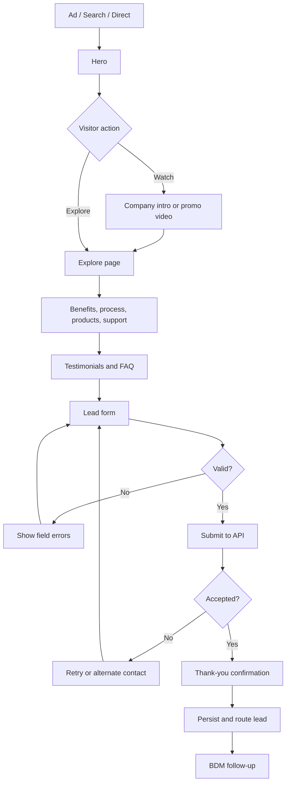
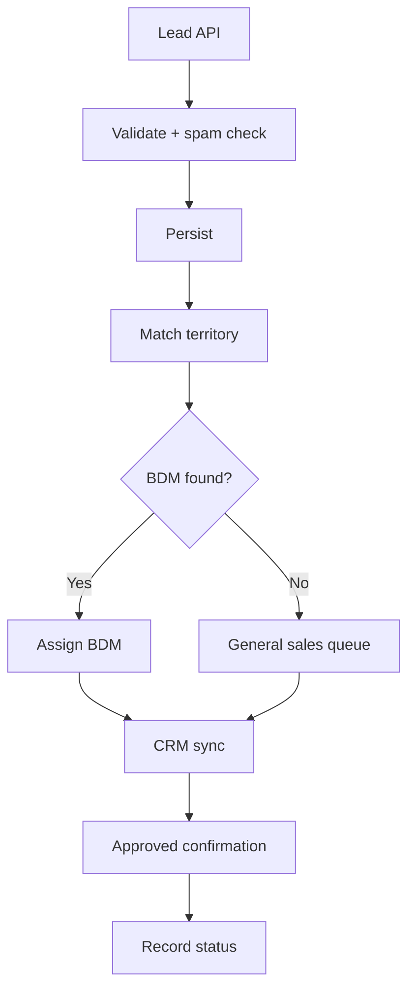

# App / Website Flow

## Visitor journey

## CTA behavior
Header/hero CTA scrolls to form; video CTA opens accessible player; WhatsApp CTA opens approved company contact. Verify all destinations before launch.

## Form behavior
Validate, disable duplicate submit, show loading. On success display reference and next steps. On failure preserve entered values and offer retry/alternate contact.

## Back-office

## Follow-up
Set an internal response SLA with sales. Do not publicly promise a callback time until operations approve it.

## Analytics events
`page_view`, `hero_cta_click`, `company_video_play`, `promo_video_play`, `lead_form_start`, `lead_form_validation_error`, `lead_submit`, `lead_submit_success`, `lead_submit_error`, `whatsapp_click`.
